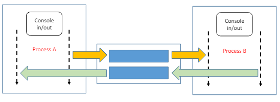

# ClientServer_OS3

This project is a __messaging application__ that facilitates communication between two interactive processes, Process A and Process B, using shared memory and POSIX semaphores for synchronization.

## Overview

Process A initializes the necessary __synchronization structures__ and __shared memory__.  
Both processes are interactive, accepting input from the user and outputting to standard output.

### Communication Start

__Communication__ between the processes is __achieved__ through __shared memory segments__.  
Each process can accept a new message from its user at any time to send to the other process.  
Similarly, it can receive a message from the other process via shared memory at any time.  
Messages entered by the user are divided into smaller pieces (up to 15 characters each) and sent to the other process via shared memory.  
The receiving process retrieves all the pieces of the message before delivering it to the user.

Both Process A and Process B are __multithreaded__.  
In each process, one thread handles __user input__ and __message sending__, while another thread __handles message receiving__ and __output__.

### Communication End

**The communication session can be ended** by either process by sending the string `"#BYE#"`,  
which is interpreted by the receiving process as a termination signal.  
Upon termination, the processes release the synchronization and shared memory structures.

### Statistics

Upon completion of an execution, the processes report:  

- The number of messages sent/received
- The number of pieces (average per message and total),
- The average waiting time for the receipt of the first piece of a new message.

### Required Technologies

The project uses the following technologies:

- __POSIX Semaphores:__ Used for synchronization between the processes.
- __Shared Memory Structures:__ Used for communication between the processes.
- __Threads:__ Both Process A and Process B are multithreaded.
- __Command Line Activation:__ The processes A and B are enabled from the command line, not automatically with a parent-child relationship.

  

## Project Structure

- __dataset:__ Contains 2 files, __shm_id.txt__ in which the ids from the shared memories are stored and __sample2.txt__ that is used for testing certain functions.
- __include:__ Contains the __.h__ files
- __src:__ Contains the __source code__.
  - __process_a.c, process_b.c:__  The two main functions of this project.
  - __modules.c__ The rest of the helper functions.  
- __tests:__ Contains __unit-tests__ for certain functions

## How to run it

- To __run the tests__, move into the __tests__ directory and write:
  - __make run__: For simple execution
  - __make valgrind:__ To run the project using valgrind

- To __run the main function__, move into the __src__ directory and write:
  - __make run_process_a or make run_process_b:__ For simple execution
  - __make valgrind_process_a or make valgrind_process_b:__ To run the project with valgrind  

**Note:** Every process (process_a, process_b) must run into a different terminal.

At the start of the execution, you will see the initialization of the semaphores and the shared memory at the terminal where process A runs.  
At the end of the execution, you will see the deallocation of the semaphores and the shared memory from Process A.
